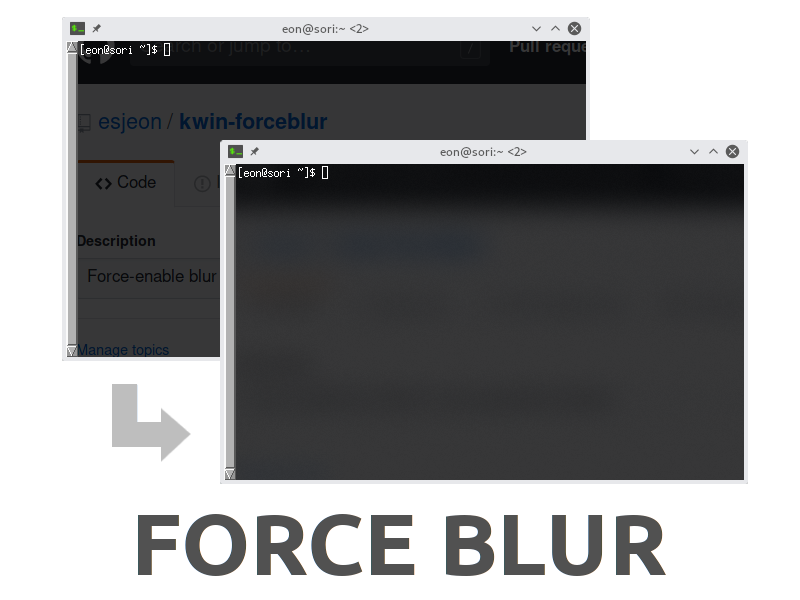

Force Blur
==========

A KWin script to force-enable KWin Blur effect on user-specified windows.

This is more useful than shell script hacks, because KWin script receives event
notification and window info from KWin. This can also fix tray-based apps,
which loses blur hints when restored from system tray.

System Requirement
------------------

* Operating System:
  - (K)Ubuntu 18.10 or newer
  - Fedora 29 or newer
  - Arch Linux - kwin 5.14 or newer

* Make sure you're using "Blur" desktop effect, which can be enabled through System Settings.

* This script internally calls `xprop` command, which would be already installed
  on your system.

* X11 display server (the script does not support wayland applications)

How to Use
----------

1. Install the script.

2. Run the following in terminal, to enable script configuration:

        mkdir -p ~/.local/share/kservices5/
        cp ~/.local/share/kwin/scripts/forceblur/metadata.desktop ~/.local/share/kservices5/forceblur.desktop

3. Open `Kwin Scripts` page in `System Settings`.

4. Enable `Force Blur` script by checking the checkbox next to it.

5. Change script settings. Note that the script can only match with window classes.

6. Click `OK` to enable the script.

7. Whenever settings are changed, you must disable and re-enable the script.  
   (Uncheck -> `Apply` -> Check -> `Apply`)

GTK CSD Shadow
--------------

Some GTK applications render client-side shadows, which look ugly if blurred. To
prevent this, you can enable "**Blur only the content of window**" option.

This works by updating the blur region info whenever a window is resized, so
might have some performance impacts. Use with caution.

Authors
-------

* Eon S. Jeon <esjeon@hyunmu.am> - main author
* Aaron Miller (https://github.com/aaronm-cloudtek) - blacklist mode

